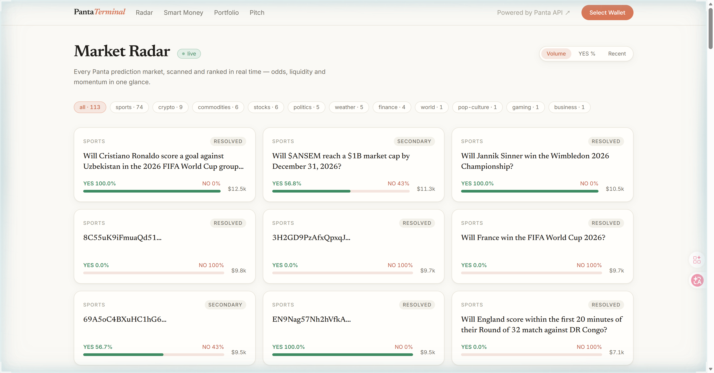
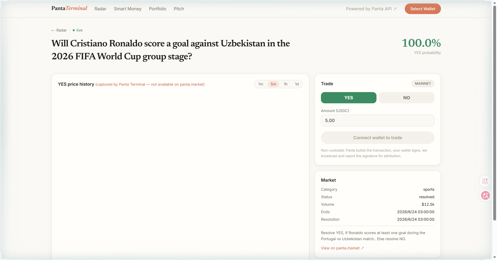
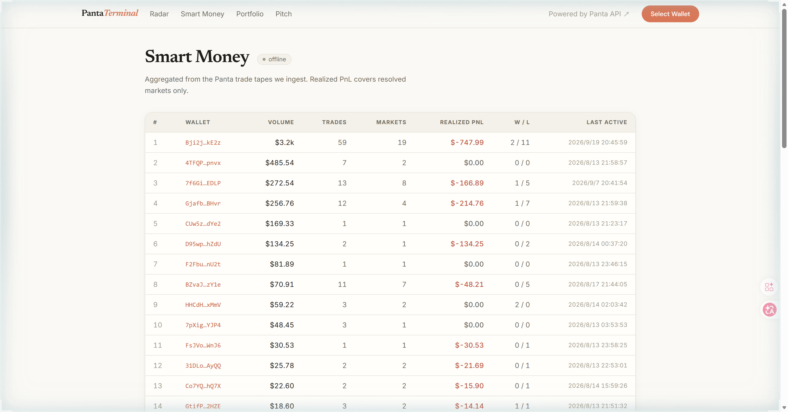
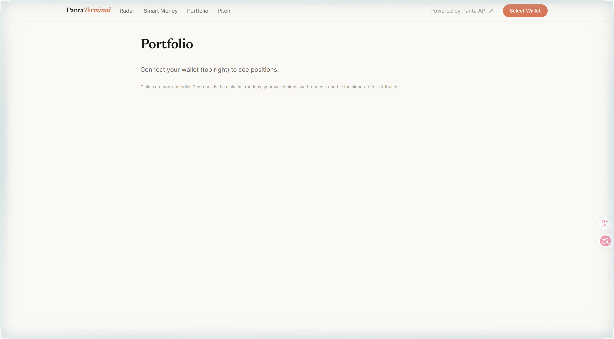
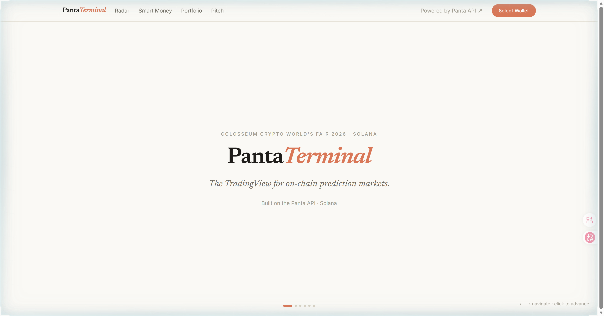

# Panta Terminal

> **The TradingView for Panta prediction markets on Solana.**

**Panta Terminal** is a full-stack market-intelligence terminal built on the Panta API: a live market radar, the ecosystem's first price-history charts, a WebSocket firehose, a smart-money leaderboard, and one-click non-custodial trading — wrapped in a warm, editorial interface.

Built for **Colosseum Crypto World's Fair 2026** (Solana main track) + the **Panta API sidetrack**.

<p align="center">
  <a href="https://panta-terminal.vercel.app"></a>
  <a href="https://panta-terminal-api.onrender.com/api/health"></a>
  <a href="./docs/SUBMISSION.md"></a>
  <a href="./docs/DEMO_SCRIPT.md"></a>
  <a href="./docs/PLAN.md"></a>
</p>

<p align="center">
  <a href="#at-a-glance">At a Glance</a> ·
  <a href="#screenshots">Screenshots</a> ·
  <a href="#quick-start">Quick Start</a> ·
  <a href="#demo-flow">Demo Flow</a> ·
  <a href="#architecture">Architecture</a> ·
  <a href="#panta-api-field-notes">API Notes</a> ·
  <a href="#docs-navigation">Docs</a>
</p>

---

## At a Glance

| Topic | Summary |
| --- | --- |
| What this is | A third-party professional terminal for the Panta prediction-market API: radar → charts → smart money → trade |
| Why it exists | The Panta API exposes **no price history, no push channel, and rotates its trade tape** — every trader flies blind; we built the missing data layer |
| What works today | 113-market live radar, OHLC charts from our own 30-second snapshotter, smart-money leaderboard with realized PnL, Phantom wallet trading (mainnet + sandbox), position claims — deployed on Vercel + Render |
| Trading model | Fully non-custodial: Panta builds the transaction, the user's wallet signs in the browser, we broadcast and report the signature for volume attribution. User funds never touch our backend |
| Stack | Rust workspace (axum + tokio + SQLite) · typed `panta-client` crate · Next.js 16 + Tailwind v4 + lightweight-charts · Solana wallet-adapter |

## Table of Contents

- [At a Glance](#at-a-glance)
- [Why This Project Exists](#why-this-project-exists)
- [What the Product Demonstrates](#what-the-product-demonstrates)
- [Screenshots](#screenshots)
- [Quick Start](#quick-start)
- [Demo Flow](#demo-flow)
- [Architecture](#architecture)
- [API Surface](#api-surface)
- [Panta API Field Notes](#panta-api-field-notes)
- [Project Structure](#project-structure)
- [Docs Navigation](#docs-navigation)
- [Future Work](#future-work)

## Why This Project Exists

Panta opened a permissionless prediction-market API on Solana — a real chance for third-party frontends. But building a trading product against it today means hitting three walls:

- **No price history.** The API answers "what's the price now" and nothing else. No candles, no charts, no momentum.
- **No push channel.** No WebSocket — every consumer polls, and every UI stales between polls.
- **A vanishing tape.** Trade history rotates out, so "who is smart money here" is unanswerable without your own capture layer.

A reskin of the API can't fix any of that. Infrastructure can.

## What the Product Demonstrates

Panta Terminal is that infrastructure, running in production:

- a Rust core fans out over the full Panta catalog every **30 seconds**, normalizing prices, backfilling titles, and persisting snapshots + trade tapes to SQLite
- the **only price-history charts in the Panta ecosystem** — the chart literally says so, because panta.market doesn't have one
- a **smart-money leaderboard** computed from the tape Panta discards: volume, realized PnL on resolved markets, win/loss
- **non-custodial trading** with volume attribution: quote → build → wallet signs → submit → verify, plus a zero-cost **sandbox mode** (`?sandbox=1`) wired to Panta's test fixtures
- a live **pitch page** whose counters tick up in real time — the demo is the product

## Screenshots

### Market Radar — every Panta market, ranked live



### Market Detail — the ecosystem's first price history, plus the trade ticket



### Smart Money — the tape Panta discards, turned into alpha



### Portfolio — positions and one-click claims



### Pitch — the live deck, counters ticking in real time



## Quick Start

### Requirements

- Rust toolchain (stable)
- Node.js 20+
- Panta API keys — register at [panta.market](https://www.panta.market/) (see [docs.panta.market](https://docs.panta.market/) → Quickstart)

### Configure

Create `.env` in the repo root:

```bash
PANTA_API_KEY="pk_live_..."
PANTA_TEST_API_KEY="pk_test_..."
DATABASE_URL="sqlite://panta-terminal.db"   # optional; this is the default
```

`.env` and the SQLite file are gitignored — never commit them.

### Run locally

```bash
# backend — http://localhost:8080  (must run from the repo root: cwd locates .env and the DB)
cargo run -p panta-terminal-server

# frontend — http://localhost:3000
cd web && npm install && npm run dev
```

### Deploy

One-command Blueprint deploys are wired for both halves — see [docs/DEPLOY.md](./docs/DEPLOY.md):

- **Backend** → Render via `render.yaml` (Docker, multi-stage Rust build; `PANTA_API_KEY` / `PANTA_TEST_API_KEY` entered as sync:false env vars)
- **Frontend** → Vercel, root directory `web`, env `NEXT_PUBLIC_API_URL=https://<your-render-url>`

## Demo Flow

Current page contract:

- `Radar` — `/`
- `Market Detail` — `/market/[id]`
- `Smart Money` — `/leaderboard`
- `Portfolio` — `/portfolio`
- `Pitch` — `/pitch`

Guided demo narrative (full script with timing in [docs/DEMO_SCRIPT.md](./docs/DEMO_SCRIPT.md)):

1. **Radar** — 113 markets scanned and ranked; category pills, volume/odds/recency sorts, live badge driven by our WebSocket
2. **Market Detail** — OHLC chart built from our own snapshots (the differentiator), resolution rules, recent tape
3. **Trade ticket** — append `?sandbox=1`: quote → build → Phantom sign → submit → verify, zero cost, deterministic success
4. **Smart Money** — wallets ranked by volume and realized PnL, computed from the persisted tape
5. **Portfolio** — connect Phantom, view positions, claim winnings non-custodially
6. **Pitch** — the live deck; snapshot counter ticks up while you present

## Architecture

```
┌──────────────────────────────────────────────────────────────────┐
│                         Panta Terminal                            │
├──────────────────────────────────────────────────────────────────┤
│                                                                   │
│  ┌───────────────────────┐      ┌─────────────────────────────┐  │
│  │  Frontend (Vercel)    │      │  Backend (Render, Docker)   │  │
│  │  Next.js 16 · TS      │─────▶│  Rust · axum · tokio        │  │
│  │  Tailwind v4          │ REST │                             │  │
│  │  lightweight-charts   │◀─────│  30 s snapshotter           │  │
│  │  wallet-adapter       │  WS  │  OHLC aggregation           │  │
│  │  (Phantom)            │      │  tape persistence           │  │
│  └───────────────────────┘      │  trade proxy + attribution  │  │
│           │ signs               │  SQLite store               │  │
│           ▼                     └──────────────┬──────────────┘  │
│  ┌───────────────────────┐                     │                 │
│  │  Solana mainnet       │◀────────────────────┘                 │
│  │  (user funds never    │      ┌─────────────────────────────┐  │
│  │   touch our backend)  │      │  Panta API (live + sandbox) │  │
│  └───────────────────────┘      │  via typed panta-client     │  │
│                                  └─────────────────────────────┘  │
└──────────────────────────────────────────────────────────────────┘
```

| Layer | Technology |
| --- | --- |
| Backend | Rust, axum, tokio, rusqlite (SQLite), tower-http |
| Panta client | typed async crate: rate-limit self-throttle (100/60s under Panta's 120 cap), retries, dual price-format normalization |
| Frontend | Next.js 16, React 19, Tailwind CSS v4, lightweight-charts, Newsreader + Inter |
| Wallet | Solana wallet-adapter (Phantom), bs58, non-custodial sign-in-browser |
| Infra | Vercel (frontend) · Render free tier (backend, ephemeral SQLite) |

## API Surface

Backend routes (all accept `?env=test` for the sandbox where a Panta call is involved):

- `GET /api/health` — service status + snapshot count
- `GET /api/markets` — radar from our snapshot store (fast); `?source=live` fans out over the Panta API
- `GET /api/markets/{id}` — detail, cached (list rows don't ship titles)
- `GET /api/markets/{id}/trades` — live tape, opportunistically persisted
- `GET /api/markets/{id}/candles?interval=60|300|900|1800|3600|86400` — OHLC from our own snapshots
- `GET /api/leaderboard?limit=50` — smart-money stats (volume, realized PnL on resolved markets, W/L)
- `POST /api/trade/quote` · `/build` · `/submit` · `/verify` — non-custodial buy flow (server holds the API key; the wallet signs in the browser)
- `GET /api/positions?wallet=` · `POST /api/claim/build` — holdings and win-claim transactions
- `GET /ws` — WebSocket fan-out: `tick` / `price` / `trade` events every 30 s

## Panta API Field Notes

Learned the hard way; the full 7-item feedback list we filed is in [docs/SUBMISSION.md](./docs/SUBMISSION.md):

- List cursor pagination loops — full coverage needs a **status × category fan-out**.
- Prices arrive both as `"0.43"` and 1e9-scaled strings; normalize via `norm_price`.
- Reads are rate-limited to ~120/60s; the client self-throttles at 100.
- The trade tape uses `blockTime` (not `timestamp`); `amountUsdc` is often null on primary buys — derive amounts from `yesAmount`/`noAmount` base units, price = amount ÷ shares.
- List rows ship with empty titles; display names need the detail endpoint (the snapshotter backfills them).

## Project Structure

```
crates/panta-client   Typed async Rust client for the Panta API (rate-limited, retrying)
crates/server         axum backend: radar, candles, WS, leaderboard, trade proxy, claims
web/                  Next.js 16 + TS + Tailwind v4 frontend (5 pages)
docs/                 PLAN · SUBMISSION · DEMO_SCRIPT · PITCH · DEPLOY · screenshots/
render.yaml           Render Blueprint (Docker)
web/                  (Vercel root directory)
```

## Docs Navigation

- [docs/PLAN.md](./docs/PLAN.md) — full product plan & schedule (Chinese)
- [docs/SUBMISSION.md](./docs/SUBMISSION.md) — sidetrack + main-track submission copy, 7 API feedback items
- [docs/DEMO_SCRIPT.md](./docs/DEMO_SCRIPT.md) — 3-minute demo script
- [docs/PITCH.md](./docs/PITCH.md) — pitch narrative
- [docs/DEPLOY.md](./docs/DEPLOY.md) — deployment runbook

## Future Work

- Price & whale alerts (Telegram / web push)
- Public history API — the capture layer, productized
- Multi-venue adapters (the same core generalizes to any venue with markets but no market data)
- Creator analytics for market issuers
- Persistent storage upgrade (Render paid disk or managed Postgres) to keep history across redeploys

## License

MIT — see [LICENSE](./LICENSE).
